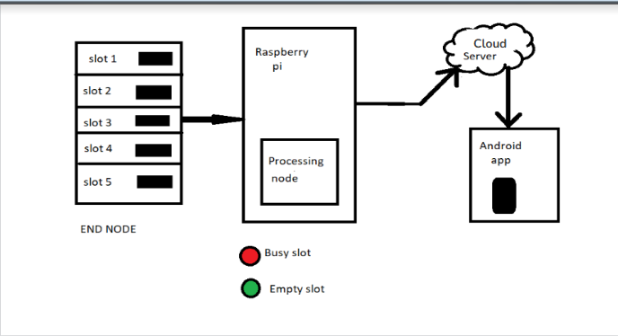
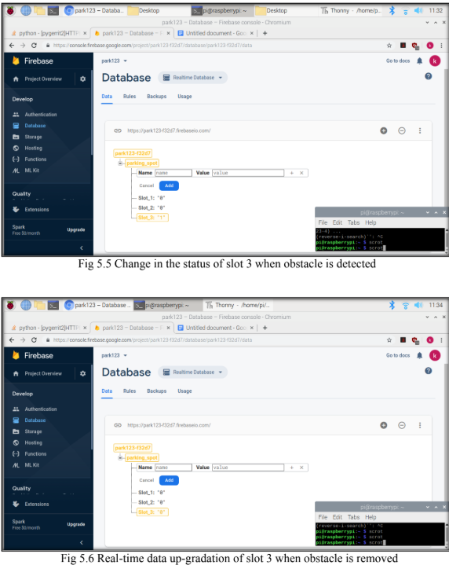
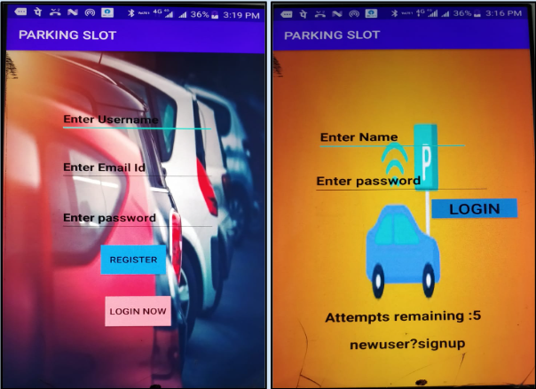
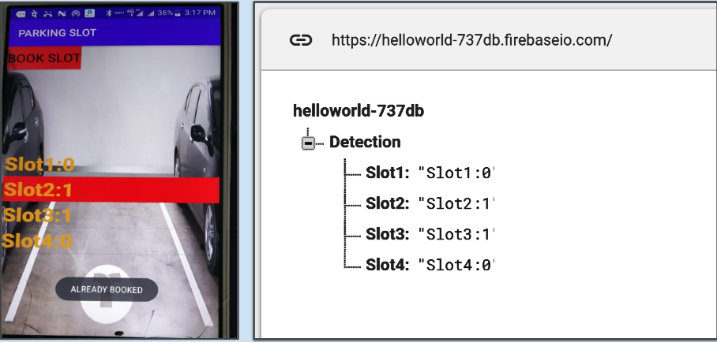
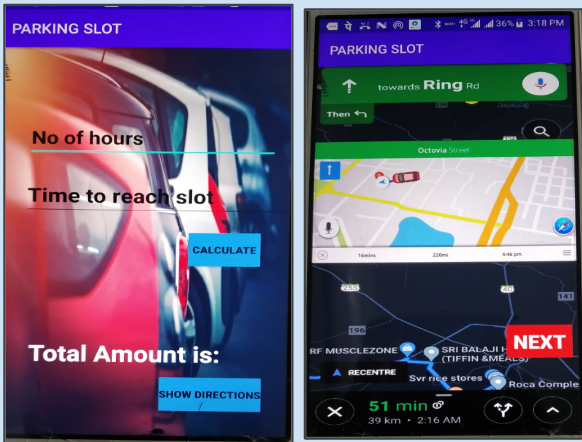

# IoT-Based Parking Slot Management System using Raspberry Pi 3 and Firebase Cloud

## Project Overview
This project aims to develop an intelligent, automated smart parking system using IoT technologies. The system optimizes parking space usage, reduces traffic congestion, and minimizes pollution and vehicle vandalism risks.

## Features & Technologies Used
- **IoT Sensors:** Infrared (IR) and Magnetic Sensors for real-time parking slot detection.
- **Processing Node:** Raspberry Pi for sensor data processing.
- **Communication Protocol:** Zigbee for low-power, secure data transmission.
- **Cloud Storage:** Firebase Realtime Database for storing parking slot availability.
- **User Applications:**
  - **Android Application:** Displays slot availability, allows reservations, and provides GPS tracking.
 

## System Architecture

1. **End Nodes:** Sensors (IR & Magnetic) detect vacant parking slots.
2. **Processing Node:** Raspberry Pi processes sensor data and transmits it.
3. **Cloud Database:** Firebase stores real-time slot data.
4. **User Interfaces:** Mobile app and web portal access parking slot availability and allow bookings.
5. **Security Features:**
   - OTP-based smart lock for slot access.

## Installation & Setup
### Raspberry Pi Configuration
1. Update the system:
   ```bash
   sudo apt-get update
   ```
2. Install GPIO library:
   ```bash
   sudo apt-get install rpi.gpio
   ```
3. Clone this repository:
   ```bash
   git clone https://github.com/Amulya275/IoT-Based-Smart-Parking-System-with-Raspberry-Pi.git
   ```
4. Install Firebase Python package:
   ```bash
   pip install firebase
   ```

### Running the System
1. Execute the sensor data collection script:
   ```bash
   python sensor_script.py
   ```
   


   *Obstacle here is Car*
3. Start the Android application (install APK on mobile device).


## Mobile App Features


- Slot availability display
- GPS tracking to navigate to booked slot
- Secure booking with OTP-based slot access

## Billing System


- Base charge: Rs. 25/hour
- Late arrival fee: Rs. 50/hour
- Total Amount Calculation:
  ```
  Total Amount = Rs. {n1 * 5 + (n2 - 1) * 10}
  ```
  where `n1` is the parking duration and `n2` is the arrival time.

## Future Enhancements
- AI-based predictive parking slot availability
- Integration with payment gateways
- Multi-floor parking assistance using advanced GPS tracking

## Contributors
- **Amulya Reddy Maligireddy**  
- **Keerthi Reddy Konda**  
- **Leela Lekkala**  
- **Sri Harini Chinnam**  

## License
This project is licensed under the MIT License - see the [LICENSE](LICENSE) file for details.

---
### Let's Park Hassle-Free 🚗💨
